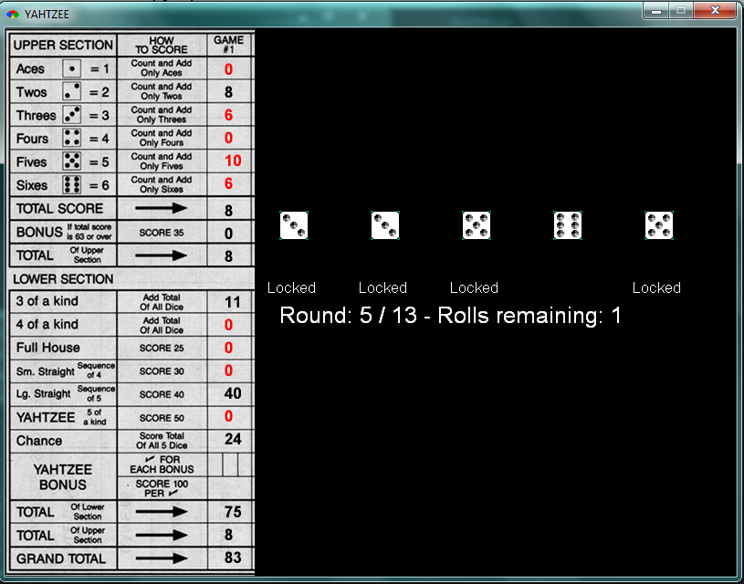

# Gosu-Yahtzee

An implementation of the dice game "Yahtzee" using [Ruby](https://www.ruby-lang.org/en/) and [Gosu](https://www.libgosu.org)

### Hotkeys

 - N - New Game
 - Enter - Next Round
 - Space - Roll
 - 1 - 5 - Lock Respective Dice
 - Q - Quit
 - Esc - Main Menu
